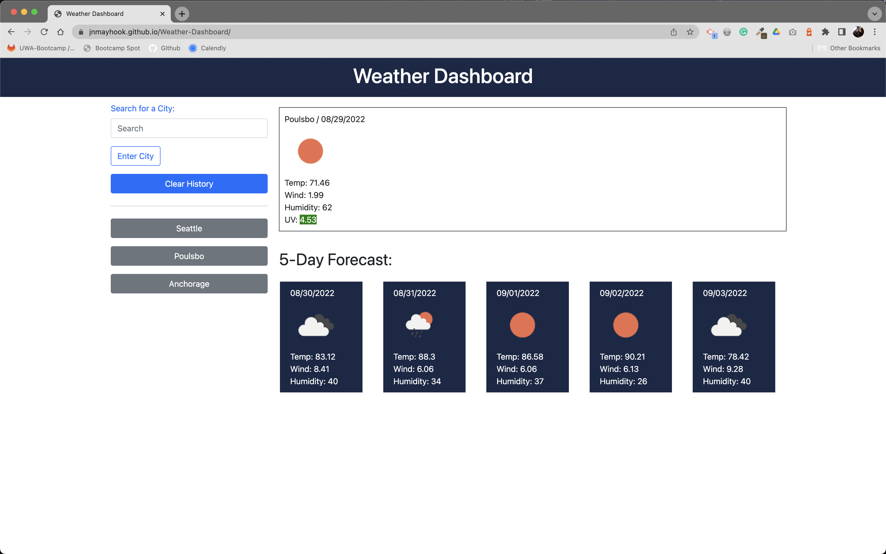

# Weather Dashboard

## Description

A responsive Weather Dashboard that displays the weather with a 5-day forecast anywhere in the world when a city is searched.  This app utilizes the Open Weather API, which provides temp, wind, humidity, and UV data. A history of the places searched is saved in local storage and displayed to be clicked and viewed again if needed.  There’s a delete history button to remove previous searches.  This app is mobile-friendly.

[Click here for the deployed app on GitHub.](https://jnmayhook.github.io/Weather-Dashboard/)


## Technologies
- HTML5
- CSS/Bootstrap Framework
- Javascript/Node.js
- JQuery
- Moment
- Open Weather API


## Installation Instructions
```
npm i
```


## Usage Instructions
Search the desired city and click the Enter City button, and the weather with a 5-day forecast is displayed.  Search a new city or click a previously searched city to display the weather forecast.  

## Screenshots



## License
This project is MIT licensed.


## Questions? 
Please contact me: 

GitHub: [@jnmayhook](https://github.com/jnmayhook)
Email: [jnmayhook@gmail.com](mailto:jnmayhook@gmail.com)

